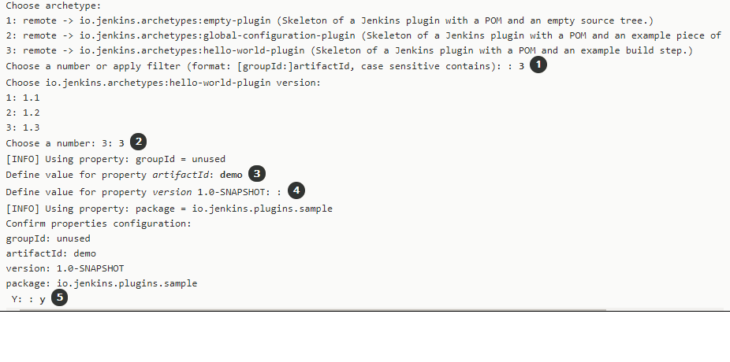

## jenkins plugins
#### 环境确认
maven 3.3.1 及以上  
jdk 8   

### 创建 jenkins 插件项目
#### 建立脚手架
选择一个项目目录  
```
  mvn -U archetype:generate -Dfilter=io.jenkins.archetypes:
```

```
上述图片说明
① 项目框架结构类型
② 想要使用的版本
③ 起个名字
④ 确认项目版本信息
⑤ 确认自己的选择(相信自己的选择是正确的)
```

#### 验证项目
```
mvn verify
```

#### 运行项目
```
mvn hpi:run -Djetty:port=<port>
```
将 \<port> => 替换为具体的端口数字  
由于脚手架用了 enforce,启动可能报错,禁掉它
```
mvn hpi:run -Djetty:port=<port> -Denforcer.skip=true
```

#### 打包
```
mvn  hpi:hpi -Denforcer.skip=true
```

### 大致概念讲解
在 src/main/java 的某个包下建了一个 java 类   
然后在 src/main/resource 下相同的目录下，要有 config.jelly 文件  
如：包 io.jenkins.plugins.sample，下面有个HelloBuilder.java 类  
那么在 src/main/resource 下，要有目录结构 io/jenkins/plugins/sample,然后在此结构下，
创建 HelloBuilder 文件目录，在该目录下创建 config.jelly 文件 和 help.html  
config.jelly 文件主要用于前台页面展示的,可以用 html 标签  
help.html 文件是说明文件  
.properties 文件基本是 i18n 相关文件，前缀要与 .jelly 文件一致  
run 命令运行构建后的东西生成在项目的 works/ 目录下  
国际化根据 .properties 文件会生成 Message 类  
生成命令 :
```
  mvn clean org.jvnet.localizer:maven-localizer-plugin:1.24:generate
```
命令结束后,需刷新项目,eclipse 中需刷新两遍

参数网址:  
https://jenkins.io/doc/developer/tutorial/extend/  
